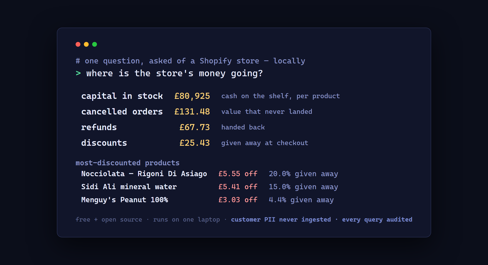

# shop-money-loop: where a Shopify store's money is going

One command answers the question Shopify's own reports don't: dlt loads your
store's orders, line items and inventory from the Admin GraphQL API into a
local DuckDB warehouse, dbt prices the leaks, and one tree says where the
money went.



```
== where the store's money is going ==
  capital in stock   £  53,800.26   (176.62% of revenue)
  discounts          £   1,737.19   (5.70% of revenue)
  refunds            £   1,593.64   (5.23% of revenue)
  cancelled orders   £     921.46   (3.03% of revenue)
  top capital in stock: Product N £9,042, Product J £8,021, Product A £7,369
```

Everything runs on your machine. Your store data never leaves it: no hosted
service, no third party, no app to install on the store beyond a read-only
custom-app token you create and control.

- refunds and discounts by month (P&L leaks)
- discounts attributed per product -- counting both line-level discounts and
  order-level allocations, which live in `discountAllocations` and are missed
  by anything that only reads `discountedTotalSet`
- margin per product after discounts and cost of goods, including how much of
  each product's potential margin the discounts consumed
- cancelled order value
- capital tied up in stock (quantity x unit cost, per product) -- this one is
  cash sitting on a shelf, not money lost; it is in the tree because it is the
  number merchants most often cannot see
- everything scaled against revenue

## Run it

Setup (own venv, fully self-contained):

    py -3.11 -m venv .venv
    .\.venv\Scripts\python.exe -m pip install -r requirements.txt

Demo mode (synthetic data, no store needed):

    .\.venv\Scripts\python.exe run.py --demo

Real store: copy `.env.example` to `.env` with the store domain and either a
custom-app Admin API token (`SHOPIFY_TOKEN`) or a Dev Dashboard app's client
credentials (`SHOPIFY_CLIENT_ID`/`SHOPIFY_CLIENT_SECRET` -- the pipeline
exchanges them for a short-lived token itself, so no long-lived token touches
disk). Scopes: read_orders, read_products, read_inventory. Then run without
--demo. Variants with no unit cost recorded show as null capital rather than
being silently priced at zero -- fixing cost data at the source is usually
the first finding.

## The governed agent layer

`run.py` publishes the marts to `shop.db`, and `commerce/semantic.yaml` is a
contract for a semantic-layer gateway ([sql-steward](https://github.com/Pawansingh3889/sql-steward)):
pre-approved metrics only (`margin_hit_by_discounts`, `discount_by_product`,
`capital_in_stock`, ...), role-checked and audited, so a local agent can
answer "which product margins were hit hardest by discounts?" in plain
English. There is no customer entity in the contract because the pipeline
never ingests customer PII -- the agent cannot leak what was never
collected.
